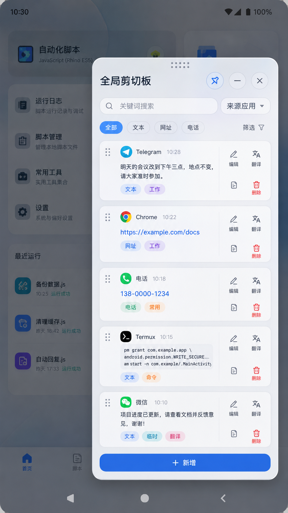

# ClipHub

> 面向 Android / ShortX 的全局悬浮剪贴板管理器。



## 项目状态

当前处于**项目骨架与数据基础层验证阶段**，尚无可用发行版本。

- 项目名称：`ClipHub`
- 中文名称：全局剪贴板
- 仓库：`7015725/ClipHub`
- 默认分支：`main`
- 主要运行环境：Android 14 / ShortX / Rhino ES5
- 数据策略：本地优先
- UI 形态：WindowManager 悬浮窗

## 项目定位

ClipHub 用于收集、查看和管理设备上的剪贴板历史，并通过悬浮窗提供快速搜索、分类、编辑、翻译和内容识别能力。

项目重点不是简单保存剪贴板文本，而是建立一套适合自动化场景的剪贴板工作流：

- 快速找到之前复制的内容；
- 根据来源应用、关键词、内容类型和自定义标签过滤；
- 识别网址、电话号码等可操作内容；
- 对内容进行置顶、编辑、删除、翻译和排序；
- 在其他应用上方通过可拖动悬浮窗完成操作；
- 为后续规则处理、自动分类和跨设备同步预留扩展边界。

## 核心功能

### 1. 全局剪贴板记录

- 监听剪贴板变化；
- 保存文本内容、复制时间和来源应用；
- 对连续重复内容进行去重；
- 避免 ClipHub 自己写入剪贴板时形成监听回环；
- 支持历史数量、保存时长和单条长度限制。

### 2. 悬浮窗

- 支持拖动整个窗口；
- 支持置顶、收起和关闭；
- 支持记忆窗口位置与尺寸；
- 标题栏作为窗口拖动区域；
- 列表拖动手柄仅用于项目排序，避免与窗口拖动冲突；
- 适配亮色、暗色和系统动态颜色。

### 3. 内容管理

- 新增剪贴板项目；
- 编辑已有项目；
- 删除单条或批量删除；
- 置顶常用内容；
- 拖动调整显示顺序；
- 将选中内容重新写入系统剪贴板；
- 对文本执行翻译；
- 查看完整内容和来源信息。

### 4. 搜索与过滤

支持组合过滤：

- 关键词；
- 来源应用；
- 内容类型；
- 自定义分类标签；
- 置顶状态；
- 时间范围。

首期内容类型：

- 普通文本；
- 网址；
- 电话号码。

### 5. 内容识别

识别结果用于展示类型、提供快捷操作和辅助过滤。

| 类型 | 识别结果 | 计划操作 |
|---|---|---|
| 网址 | `https://example.com/docs` | 打开、复制、分享 |
| 电话 | `138-0000-1234` | 拨号、复制 |
| 文本 | 普通文本或命令片段 | 编辑、复制、翻译 |

识别逻辑不能修改原始文本；原始内容必须完整保留。

### 6. 自定义标签

- 新建、重命名和删除标签；
- 支持标签名称与颜色；
- 一条剪贴板记录可绑定多个标签；
- 支持按标签过滤；
- 删除标签时不删除剪贴板原始记录。

示例：

- 工作
- 常用
- 临时
- 命令
- 翻译

## 目标运行环境

```text
Android 14 / API 34
ShortX JavaScript 任务
Rhino JavaScript ES5
system_server / uid=1000
Root / KernelSU
Android WindowManager
SQLite
```

### JavaScript 约束

项目代码默认遵守：

- 严格使用 Rhino ES5 兼容语法；
- 不使用 `let`、`const`、箭头函数、类和模板字符串；
- Android 类通过 `Packages` 或兼容方式调用；
- 不依赖浏览器 DOM；
- 不假设 WebView 可用；
- UI、数据库和监听器必须显式管理生命周期。

## 当前进度

已完成：

- 单入口与 15 个本地 JavaScript 子模块骨架；
- 统一命名空间和模块生命周期；
- 文件锁单实例保护；
- 运行目录、eval 作用域和双任务文件锁真机探测；
- SQLite schema v1、迁移框架、参数绑定和显式事务封装；
- Repository 基础 CRUD、软删除、恢复和标签关联接口。

正在验证：

- Android 原生 SQLite 提交、回滚、foreign key 和重开行为；
- 真实模块加载和 Repository 真机 CRUD。

尚未实现：

- ClipboardManager 实际监听；
- 来源应用探测；
- 悬浮窗 UI；
- 完整搜索、过滤和翻译链路。

## 初步交互结构

```text
┌────────────────────────────────────┐
│ 拖动区域   全局剪贴板   置顶 收起 关闭 │
├────────────────────────────────────┤
│ 搜索关键词              来源应用 ▼ │
│ 全部  文本  网址  电话       筛选 │
├────────────────────────────────────┤
│ ⋮⋮  来源 / 时间                   │
│     剪贴板内容预览                 │
│     类型标签  自定义标签            │
│                    编辑 翻译 删除  │
├────────────────────────────────────┤
│                 + 新增             │
└────────────────────────────────────┘
```

## 项目目录

```text
ClipHub/
├── ClipHub.js                 # ShortX 入口文件
├── README.md
├── docs/
│   ├── 产品需求.md
│   ├── 技术架构.md
│   ├── 交互规范.md
│   ├── 开发计划.md
│   ├── 模块规范.md
│   ├── 真机探测说明.md
│   ├── SQLite探测说明.md
│   ├── probe-results/
│   └── images/
│       └── cliphub-ui-concept.png
├── probes/
│   ├── cliphub_runtime_probe_001.js
│   ├── cliphub_lock_probe_002.js
│   └── cliphub_database_probe_003.js
├── src/
│   ├── ch_01_base.js
│   ├── ch_02_log.js
│   ├── ch_03_database.js
│   ├── ch_04_clipboard.js
│   ├── ch_05_classifier.js
│   ├── ch_06_repository.js
│   ├── ch_07_theme.js
│   ├── ch_08_window.js
│   ├── ch_09_list.js
│   ├── ch_10_editor.js
│   ├── ch_11_filter.js
│   ├── ch_12_translation.js
│   ├── ch_13_settings.js
│   ├── ch_14_event_bus.js
│   └── ch_15_app.js
└── scripts/
    └── validate_es5.py
```

项目采用单仓库、单入口和本地 JavaScript 子模块结构；这些子模块不是 Git Submodule。运行目录与源码仓库分离，具体约定参见 [模块规范](docs/模块规范.md)。

## 数据模型概览

核心数据表包括：

- `clipboard_items`：剪贴板记录；
- `tags`：自定义标签；
- `clipboard_item_tags`：记录与标签的关联；
- `settings`：项目设置；
- `schema_meta`：数据库结构版本。

详细字段参见 [技术架构](docs/技术架构.md)。

## 开发原则

1. **原始数据优先**  
   分类、翻译和识别结果不能覆盖原始剪贴板内容。

2. **避免监听回环**  
   ClipHub 主动复制内容后，必须识别并抑制自身产生的重复事件。

3. **UI 与数据分离**  
   WindowManager 页面不能直接拼接数据库逻辑。

4. **主线程边界明确**  
   View 创建、修改和移除必须回到所属 UI 线程。

5. **可恢复**  
   悬浮窗异常关闭、脚本重启或模块加载失败时，不应损坏数据库。

6. **本地优先**  
   默认不上传剪贴板内容，不在日志中记录完整敏感文本。

7. **渐进实现**  
   先完成稳定的记录、列表和复制链路，再增加翻译、自动分类等高级能力。

## 文档导航

- [产品需求](docs/产品需求.md)
- [技术架构](docs/技术架构.md)
- [交互规范](docs/交互规范.md)
- [开发计划](docs/开发计划.md)
- [模块规范](docs/模块规范.md)
- [真机探测说明](docs/真机探测说明.md)
- [SQLite 探测说明](docs/SQLite探测说明.md)

## 分支建议

初期建议：

- `main`：可运行、经过基本验证的版本；
- `beta`：功能开发与设备验证版本。

在首个可运行骨架完成前，可以只保留 `main`，避免过早增加分支维护成本。

## 许可证

许可证尚未确定。在明确开源范围、代码复用规则和发布方式前，不添加默认许可证。

## 说明

ClipHub 是独立项目，不直接耦合 ToolHub-FloatBall。后续可以通过明确接口与 ToolHub 集成，但两者应分别维护入口、数据库、日志和更新生命周期。
